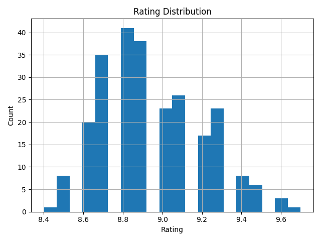
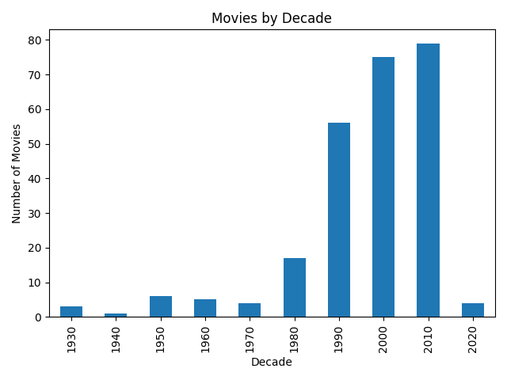
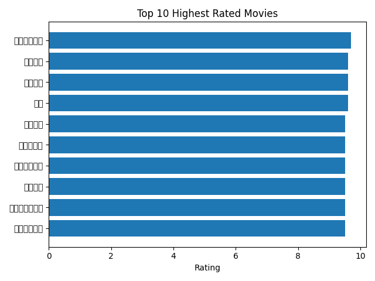
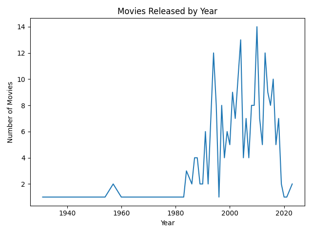
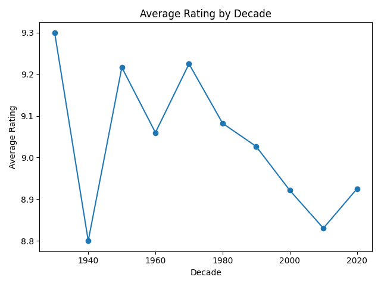

# Douban Top250 Movie Analysis
使用 Python 对豆瓣 Top250 电影数据进行分析与可视化，挖掘评分分布、年代特征、高分电影等核心信息。

## 项目简介
本项目基于豆瓣 Top250 电影公开数据，通过 Python 完成数据清洗、统计分析，并利用 matplotlib 实现多维度可视化，直观呈现豆瓣 Top250 电影的评分特征、年代分布、高分榜单等关键信息，为电影爱好者和数据分析学习者提供参考。

## 技术栈
- Python 3.x
- pandas：数据处理与分析
- matplotlib：数据可视化
- numpy（可选）：数值计算辅助

## 项目结构
```text
douban-top250-analysis/
├── analysis/          # 核心分析代码目录
│   └── analysis.py    # 数据处理与可视化主脚本
├── data/              # 数据文件目录
│   └── douban_top250.csv  # 豆瓣Top250电影原始数据
├── output/            # 可视化结果输出目录
│   ├── rating_distribution.png  # 评分分布图表
│   ├── movies_by_decade.png     # 各年代电影数量分布图表
│   ├── top10_movies.png         # Top10高分电影图表
│   └── movies_by_year.png       # 上映年份趋势图表
└── README.md          # 项目说明文档
```

## 数据分析结果

### 1️⃣ 电影评分分布
展示豆瓣 Top250 电影的整体评分分布情况，呈现高分电影的评分集中度特征。



---

### 2️⃣ 各年代电影数量分布
按十年为单位统计 Top250 电影的数量分布，直观体现不同年代的经典电影产出情况。



---

### 3️⃣ Top10 高分电影
筛选评分最高的 10 部电影，展示片名、评分等核心信息。

<p align="center">


---

### 4️⃣ 电影上映年份趋势
展示 Top250 电影在不同年份的数量分布趋势，反映经典电影的时间分布特征。



### 5️⃣ 不同年代电影的平均评分

对比不同年代电影在豆瓣 Top250 中的平均评分。



## 结论总结

- 豆瓣 Top250 电影的评分整体集中在较高区间，说明该榜单以口碑优秀的电影为主。
- 从上映年代分布来看，电影数量在 1990 年代和 2000 年代较为集中，反映出这一时期高质量电影产出较多。
- Top10 高分电影的评分差距较小，经典影片之间的口碑水平较为接近。
- 从年份趋势来看，Top250 电影在不同年份分布并不均匀，部分年份出现高质量电影集中涌现的现象。
- 不同年代电影的平均评分存在一定差异，早期经典电影整体评分略高，体现出时间沉淀对电影口碑的影响。


## 使用方法

### 前置条件
1. 安装 Python 3.x 环境
2. 安装依赖库：
   ```bash
   pip install pandas matplotlib
   ```

### 运行步骤
1. 克隆/下载项目到本地，确保目录结构完整
2. 将豆瓣 Top250 电影数据文件（douban_top250.csv）放入 `data/` 目录（数据字段建议包含：电影名、评分、上映年份、导演、类型等）
3. 执行分析脚本：
   ```bash
   python analysis/analysis.py
   ```
4. 运行完成后，可视化图表会自动生成并保存到 `output/` 目录

## 数据说明
`douban_top250.csv` 建议包含以下核心字段（可根据实际爬取数据调整）：

| 字段名       | 说明               | 示例           |
|--------------|--------------------|----------------|
| title        | 电影名称           | 肖申克的救赎   |
| rating       | 电影评分           | 9.7            |
| release_year | 上映年份           | 1994           |
| director     | 导演               | 弗兰克·德拉邦特 |
| genre        | 电影类型           | 剧情/犯罪      |

## 注意事项
1. 若运行时出现中文乱码，可在 `analysis.py` 中添加 matplotlib 中文配置：
   ```python
   import matplotlib.pyplot as plt
   plt.rcParams['font.sans-serif'] = ['SimHei']  # 显示中文
   plt.rcParams['axes.unicode_minus'] = False    # 显示负号
   ```
2. 数据文件编码建议使用 UTF-8，避免读取报错
3. 若需调整可视化样式（如颜色、尺寸、图表类型），可修改 `analysis.py` 中的绘图参数

## 扩展方向
- 增加电影类型分析（如各类型电影数量、评分分布）
- 分析导演/演员与高分电影的关联
- 结合电影时长、票房等维度深化分析
- 使用 seaborn/plotly 实现更美观的可视化效果

